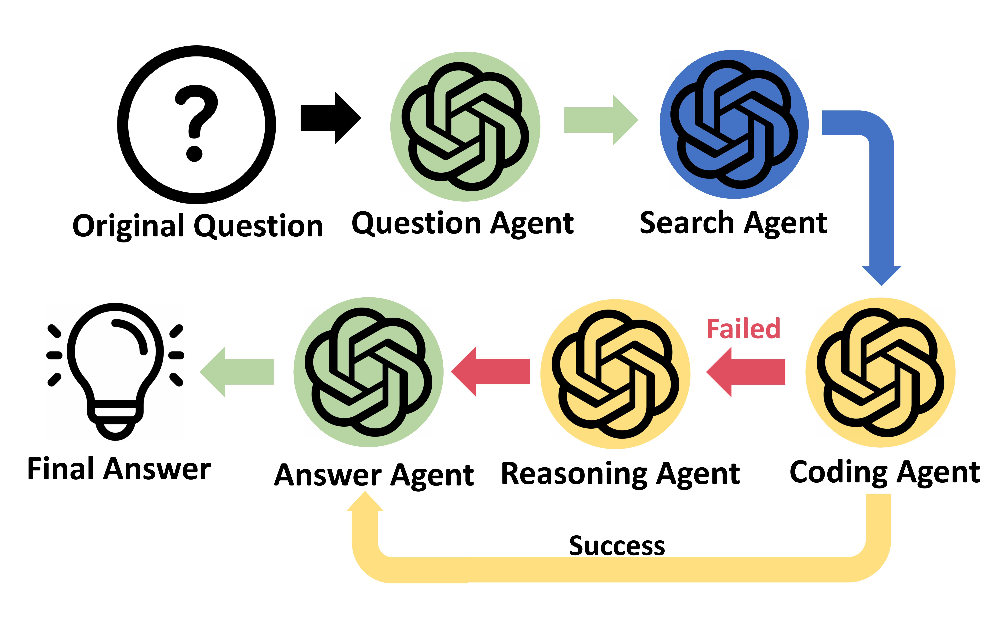
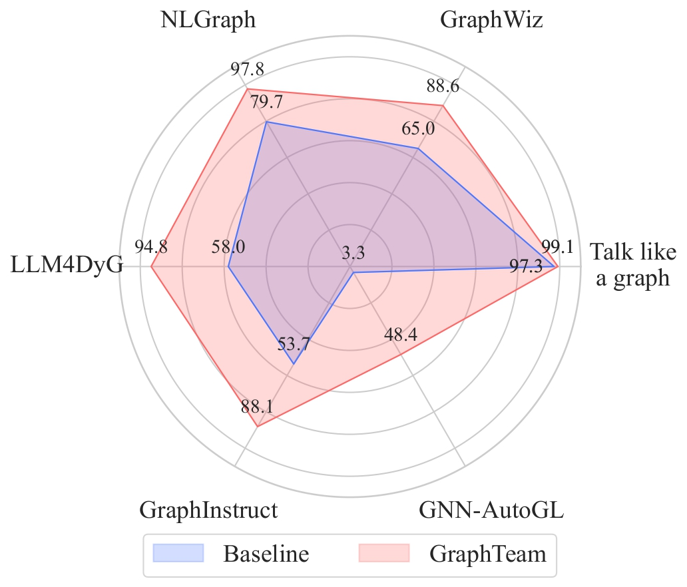

# GraphTeam

Official Repository of "GraphTeam: Facilitating Large Language Model-based Graph Analysis via Multi-Agent Collaboration".

* **Paper Link:** ([[2410.18032] GraphTeam: Facilitating Large Language Model-based Graph Analysis via Multi-Agent Collaboration](https://arxiv.org/abs/2410.18032))

## Contents

- [Introduction](#introduction)
- [System Requirements](#system-requirements)
- [Installation Steps](#installation-steps)
  - [1. Create a Conda Virtual Environment](#1-create-a-conda-virtual-environment)
  - [2. Install Dependencies](#2-install-dependencies)
  - [3. Using Docker](#3-using-docker)
- [Running the Project](#running-the-project)
  - [1. Activate the Conda Environment](#1-activate-the-conda-environment)
  - [2. Start the Docker Container](#2-start-the-docker-container)
  - [3. Run `run.py`](#3-run-runpy)
- [Frequently Asked Questions](#frequently-asked-questions)

## Introduction

Graphs are widely used for modeling relational data in real-world scenarios, such as social networks and urban computing. While large language models (LLMs) have achieved strong performance in many areas, existing LLM-based graph analysis approaches either integrate graph neural networks (GNNs) for specific machine learning tasks (e.g., node classification), limiting their transferability, or rely solely on LLMs’ internal reasoning ability, resulting in suboptimal performance.

To address these limitations, we leverage recent advances in LLM-based agents, which have demonstrated the capability to utilize external knowledge or tools for problem-solving. By simulating human problem-solving strategies such as analogy and collaboration, we propose a multi-agent system based on LLMs named **GraphTeam** for graph analysis.

GraphTeam consists of five LLM-based agents from three modules, where agents with different specialties collaborate to address complex problems. Specifically:

1. **Input-Output Normalization Module**:

   - The **Question Agent** extracts and refines four key arguments (e.g., graph type and output format) from the original question to facilitate problem understanding.
   - The **Answer Agent** organizes the results to meet the output requirements.
2. **External Knowledge Retrieval Module**:

   - We build a knowledge base consisting of relevant documentation and experience information.
   - The **Search Agent** retrieves the most relevant entries from the knowledge base for each question.
3. **Problem-Solving Module**:

   - Given the retrieved information from the Search Agent, the **Coding Agent** uses established algorithms via programming to generate solutions.
   - If the Coding Agent fails, the **Reasoning Agent** directly computes the results without programming.

Extensive experiments on six graph analysis benchmarks demonstrate that GraphTeam achieves state-of-the-art performance with an average 25.85% improvement over the best baseline in terms of accuracy.

The overall pipeline of our multi-agent system GraphTeam (left), and the comparison between GraphTeam and state-of-the-art baseline on six benchmarks (right).


<div style="display: flex; justify-content: space-between;">
  
  
</div>

The overall framework of GraphTeam, which includes five agents from three functional groups.


Performance with respect to different task categories.


Performance with respect to different output formats.


Hyper-parameter analysis of four hyper-parameter in the proposed GraphTeam

<div style="display: flex; justify-content: space-between;">
  
  
  
  
</div>

Performance comparison on six graph analysis benchmarks in terms of accuracy (%).


## System Requirements

- **Operating System** : Compatible with  **Windows** ,  **Linux** , and  **macOS** .  **Note** : AutoGL only supports x86 platforms, so Macs with M-series chips cannot run GNN_benchmark.
- **Conda**: Installed
- **Docker**: Installed and running

## Installation Steps

### 1. Create a Conda Virtual Environment

First, create a Conda virtual environment with a specified Python version.

```bash
conda create -n myenv python=3.10.14
```

Activate the virtual environment:

```bash
conda activate myenv
```

### 2. Install Dependencies

With the virtual environment activated, run the following command to install the project dependencies:

```bash
pip install -r requirements.txt
```

### 3. Using Docker

Docker is used to execute code after it is generated. Follow these steps:

#### 3.1 Pull the Specified Docker Image

```bash
docker pull chuqizhi72/execute_agent_environment:latest
```

#### 3.2 Create a Container Named `test`

```bash
docker create --name test chuqizhi72/execute_agent_environment:latest
```

## Running the Project

### 1. Activate the Conda Environment

Ensure that the Conda virtual environment is activated. If not, run:

```bash
conda activate myenv
```

### 2. Start the Docker Container

Ensure the Docker container is started. If not, run:

```bash
docker start test
docker exec -it test /bin/bash
```

### 3. Run `run.py`

Within the activated virtual environment, navigate to the project directory, ensure your current working directory is set to `multi-agents-4-graph-analysis`, and set your OpenAI API key in `run.py`. Then, run `run.py`:

```bash
cd multi-agents-4-graph-analysis
```

**Setting the OpenAI API Key:**

1. Open `run.py` located at `multi-agents-4-graph-analysis/GraphTeam/run.py` in your preferred text editor.
2. Locate the line where the OpenAI API key is set. It should look like this:

   ```python
   os.environ['OPENAI_API_KEY'] = 'your-api-key-here'
   ```
3. Replace `'your-api-key-here'` with your actual OpenAI API key:

   ```python
   os.environ['OPENAI_API_KEY'] = 'sk-your-openai-api-key'
   ```

**Running the Script:**

After setting the API key, execute the script from the `multi-agents-4-graph-analysis` directory:

```bash
python GraphTeam/run.py
```

**Note for Running the NLGraph Benchmark:**

The project includes an `answer_format_dict` that specifies the required output format for different problem types. To ensure consistency and accuracy in the results when running the NLGraph benchmark, you need to modify the `run_threaded` function in the `run.py` file.

1. Open `run.py` located at `multi-agents-4-graph-analysis/GraphTeam/run.py` in your preferred text editor.
2. Locate the `run_threaded` function and answer_format_dict.
3. Find the following commented lines within the function:

   ```
   # if is NLGraph, the question should add output format
   # question = question + answer_format_dict[category_data['type'][i]]
   ```
4. Uncomment these lines by removing the `#` symbols:

   ```
   # if is NLGraph, the question should add output format
   question = question + answer_format_dict[category_data['type'][i]]
   ```

This modification ensures that each question includes the appropriate output format directive, guiding the system to format the output correctly and enhancing the reliability of the results.

## Questions

### Q1: I Encounter an Error When Running `run.py`

**Solution**: Ensure all dependencies are correctly installed and that both the Conda environment and Docker are activated. Check the paths and configurations in `run.py` to ensure they are correct. Additionally, verify that you have set your OpenAI API key correctly in `run.py`.

### Q2: What Should Be the Working Directory When Running the Project?

**Solution**: When running the project, ensure that your current working directory is set to `multi-agents-4-graph-analysis`. This ensures that all relative paths and configurations function correctly.

### Q3: Where Can I Find the Knowledge Base Used by the Search Agent?

**Solution**: The relevant documentation is located in the `data` directory of the project. The relevant documentation is located in the `memory` directory of the project. Ensure that all relevant files are present and properly formatted.

### Q4: How Do I Modify Questions When Running the NLGraph Benchmark?

The project includes an `answer_format_dict` that specifies the required output format for different problem types. To ensure consistency and accuracy in the results when running the NLGraph benchmark, you need to modify the `run_threaded` function in the `run.py` file.

1. Open `run.py` located at `multi-agents-4-graph-analysis/GraphTeam/run.py` in your preferred text editor.
2. Locate the `run_threaded` function.
3. Find the following commented lines within the function:

   ```
   # if is NLGraph, the question should add output format
   # question = question + answer_format_dict[category_data['type'][i]]
   ```
4. Uncomment these lines by removing the `#` symbols:

   ```
   # if is NLGraph, the question should add output format
   question = question + answer_format_dict[category_data['type'][i]]
   ```

This modification ensures that each question includes the appropriate output format directive, guiding the system to format the output correctly and enhancing the reliability of the results.

## Acknowledgement

We would like to acknowledge the following contributors for their valuable support and contributions to the GraphTeam project:

* **Yubin Chen** ([1shuimo](https://github.com/1shuimo))
* **Zekai Yu** ([yuzekai1234](https://github.com/yuzekai1234))
* **Yang Liu** ([AckerlyLau](https://github.com/AckerlyLau))
* **Yaoqi Liu** ([dddg617](https://github.com/dddg617))

Their dedication and expertise have been instrumental in the development and success of this project.
